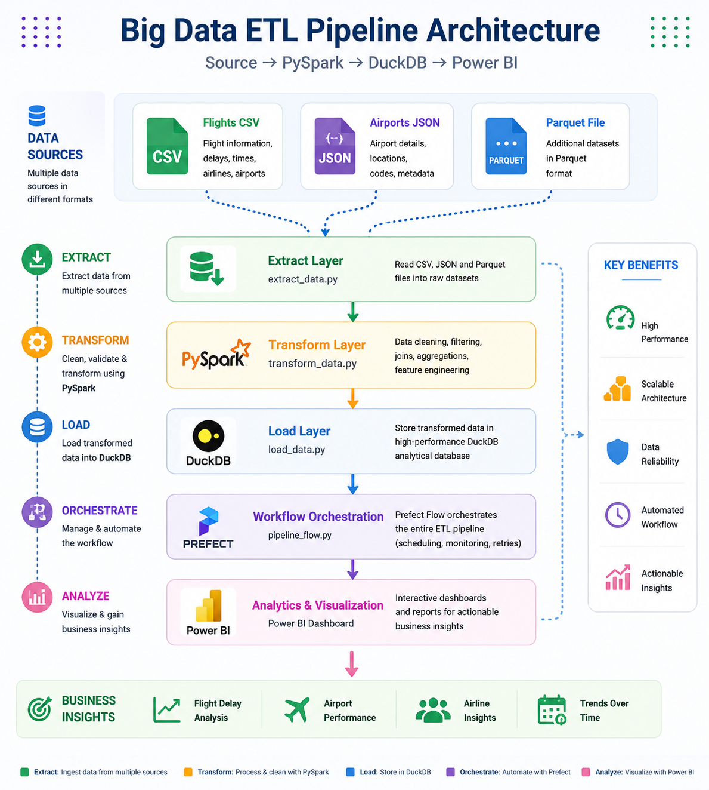
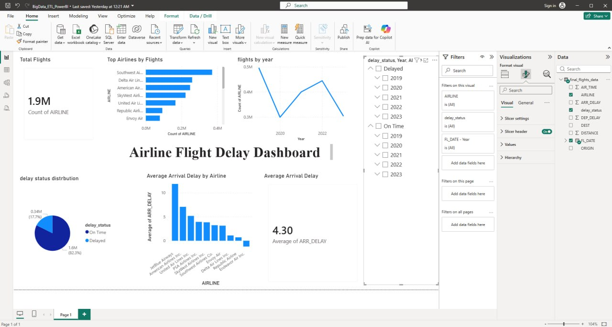

# Big Data ETL Pipeline and Flight Delay Analytics

## Contributors

| No. | Name | Student ID |
|----|----------------------|-------------|
| 1 | BISRAT ENDALE | DBU1401063 |
| 2 | DAGIMAWIT KELEM | DBU1501101 |
| 3 | ZELEKE MEKONNEN | DBU1501598 |
| 4 | FIKRE TIBEBU | DBUR/0737/13 |
| 5 | ASHENAFI ABERA | DBU1403014 |
| 6 | FITALEW ABATE | DBU1501210 |
| 7 | ELEFACHEW FETENE | DBU1501148 |
| 8 | RAHEL MEKONEN | DBU1501427 |
| 9 | FIREHIWOT TESFAYE | DBU1501207 |

---
## Project Overview

This project implements a complete ETL (Extract, Transform, Load) pipeline for airline flight data analysis using PySpark, DuckDB, and Power BI.

The pipeline extracts raw flight datasets, performs cleaning and transformation using PySpark, stores analytical data in DuckDB, and visualizes insights through an interactive Power BI dashboard.

The goal of the project is to analyze airline delays, flight trends, and airline performance using big data technologies and business intelligence tools.

---

## Project Objectives

- Extract and integrate flight datasets from multiple sources
- Clean and transform large-scale flight data using PySpark
- Store processed analytical data in DuckDB
- Generate optimized Parquet files
- Build an interactive Power BI dashboard
- Analyze airline delay trends and flight performance

---

## Technologies Used

- Python
- PySpark
- DuckDB
- Power BI
- Pandas
- Parquet
- Git & GitHub

---

## Project Structure

BIG_DATA_ETL/
│
├── dashboard/
│   ├── Architecture_diagram.png
│   ├── BigData_ETL_PowerBI.pbix
│   └── dashboard_screenshot.jpg
│
├── data/
│   ├── airports.json
│   └── airports_clean.json
│
├── orchestration/
│   └── pipeline_flow.py
│
├── scripts/
│   ├── convert_airports.py
│   ├── extract_data.py
│   ├── load_data.py
│   ├── test_json.py
│   └── transform_data.py
│
├── .gitignore
├── README.md
└── requirements.txt

---

## Pipeline Architecture

The project follows a modern ETL architecture:

Source Data → PySpark → DuckDB → Power BI

Steps:
1. Extract raw data from CSV, JSON, and Parquet files
2. Transform and clean data using PySpark
3. Load transformed data into DuckDB
4. Orchestrate workflow using Prefect
5. Visualize insights using Power BI

### Architecture Diagram

---

## Dataset Description

The final flights table in DuckDB contains:

| Column Name   | Description |
|---------------|-------------|
| FL_DATE       | Flight date |
| AIRLINE       | Airline name/code |
| ORIGIN        | Origin airport |
| DEST          | Destination airport |
| ARR_DELAY     | Arrival delay in minutes |
| DEP_DELAY     | Departure delay in minutes |
| AIR_TIME      | Flight air time |
| DISTANCE      | Flight distance |
| delay_status  | Delayed or On Time |

---

## Setup Instructions

### 1. Clone the Repository

git clone https://github.com/Dagidag7/Big_data_etl.git
cd Big_data_etl

### 2. Create Virtual Environment

python -m venv venv

### 3. Activate Virtual Environment

#### Windows

venv\Scripts\activate

#### Linux / Mac

source venv/bin/activate

### 4. Install Dependencies

pip install -r requirements.txt

---

## Running the ETL Pipeline

### Run Extraction

python scripts/extract.py

### Run Transformation

python scripts/transform.py

### Run Loading Process

python scripts/load.py

---

## Power BI Dashboard

The Power BI dashboard provides:

- Total flights KPI
- Flight trends by year
- Delay status distribution
- Top airlines by flights
- Average arrival delay by airline

---

## Dashboard Preview

---

## Sample SQL Queries

### Count Delayed vs On-Time Flights

SELECT delay_status, COUNT(*) AS count
FROM flights
GROUP BY delay_status;

### Average Arrival Delay by Airline

SELECT AIRLINE, AVG(ARR_DELAY) AS avg_delay
FROM flights
GROUP BY AIRLINE
ORDER BY avg_delay DESC;

### Top 10 Routes with Most Delays

SELECT ORIGIN, DEST, COUNT(*) AS delayed_count
FROM flights
WHERE delay_status = 'Delayed'
GROUP BY ORIGIN, DEST
ORDER BY delayed_count DESC
LIMIT 10;

---

## Output Locations

- Parquet files: output/flights_parquet/
- DuckDB database: output/flights.duckdb
- Cleaned data: output/flights_cleaned/

---

## Key Insights

- Most flights were completed on time
- Some airlines experienced significantly higher arrival delays
- Flight activity changed across different years
- Delay patterns varied between airlines and routes

---

## Future Improvements

- Unified ETL pipeline workflow
- Better error handling and logging
- Add configuration files
- Add automated testing
- Data validation and schema checks
- Airport metadata enrichment
- Incremental data processing
- Workflow orchestration using Prefect or Airflow
- Real-time dashboard updates

---
## Conclusion

This project demonstrates the implementation of a scalable ETL pipeline using modern big data tools and business intelligence technologies. The system successfully processes flight datasets, stores analytical outputs efficiently, and visualizes meaningful insights through Power BI dashboards.